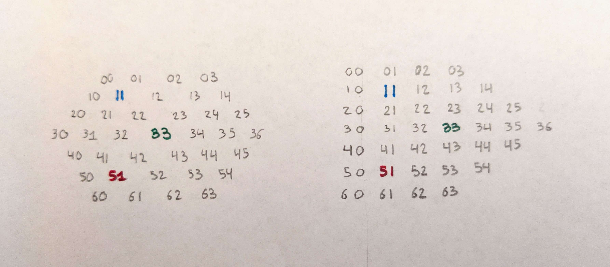
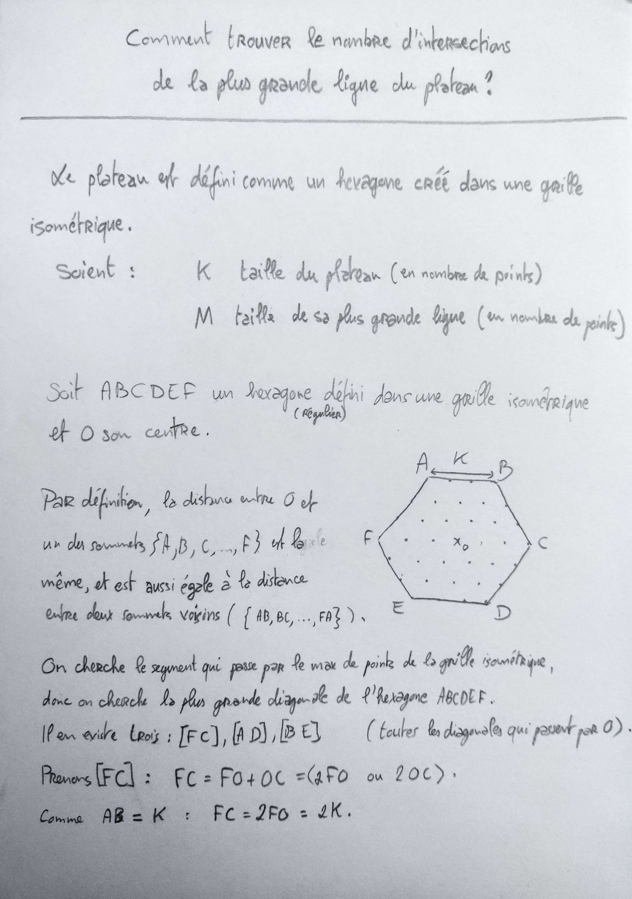
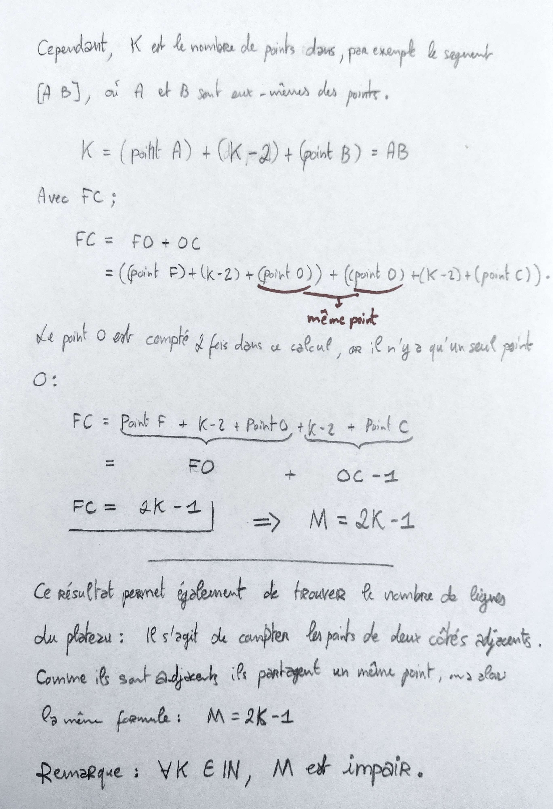
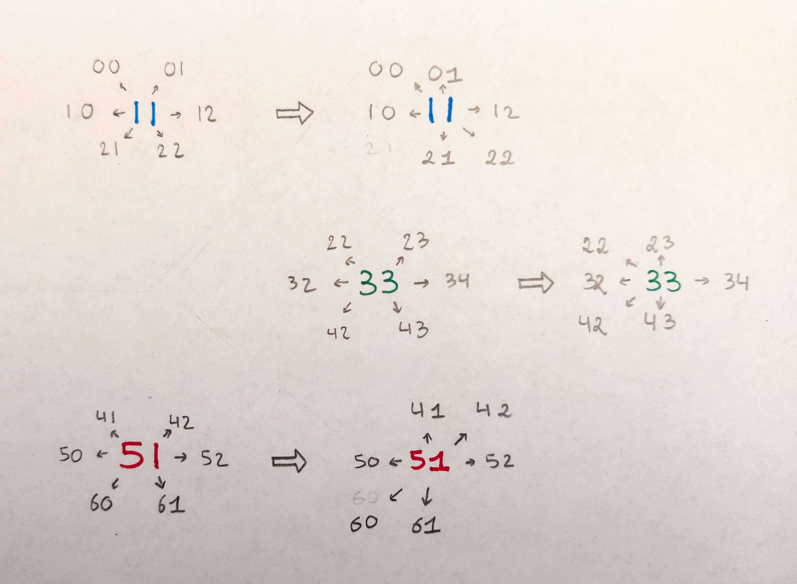
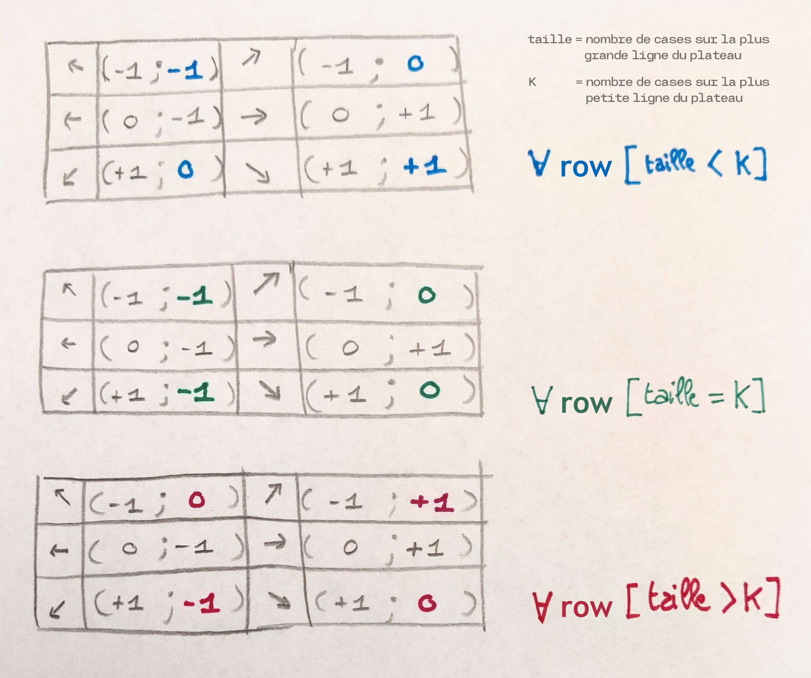

SPRINT N°2
--------------------------
_semaine du 30/01_

## Tâches terminées
- Comprendre comment traduire la représentation du plateau que l'ont voit en une structure informatique.
    - tests sur papier : 
        
    - dimension du plateau - trouver la hauteur à partir d'un plateau de longueur K :
        
        

- Connaître les changements que produisent un déplacement de pièce : matrice des vecteurs de directions.
    
    

## To-Do

- Première version d'un `Move`, conditions de déplacement pour une pièce.
- Créations d'Enums, créations des fonctions et création des fichiers / arborescence.
- Classe `Game` et affichage terminal.
- Regroupement et merge des travaux + Début de la scène en prévision de commencer à créer la vue.